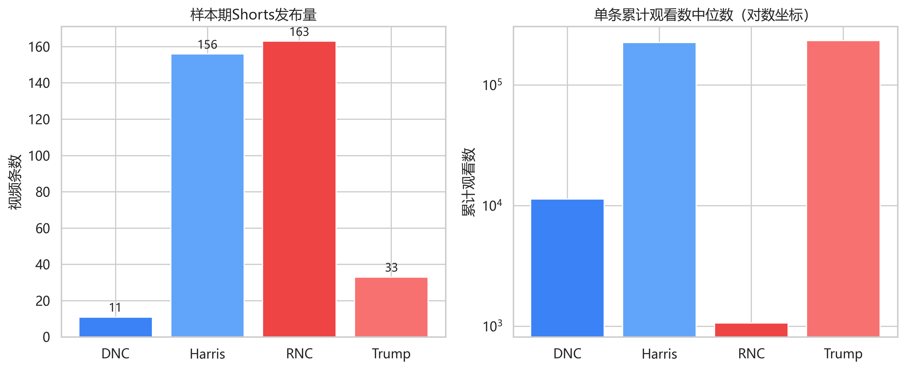
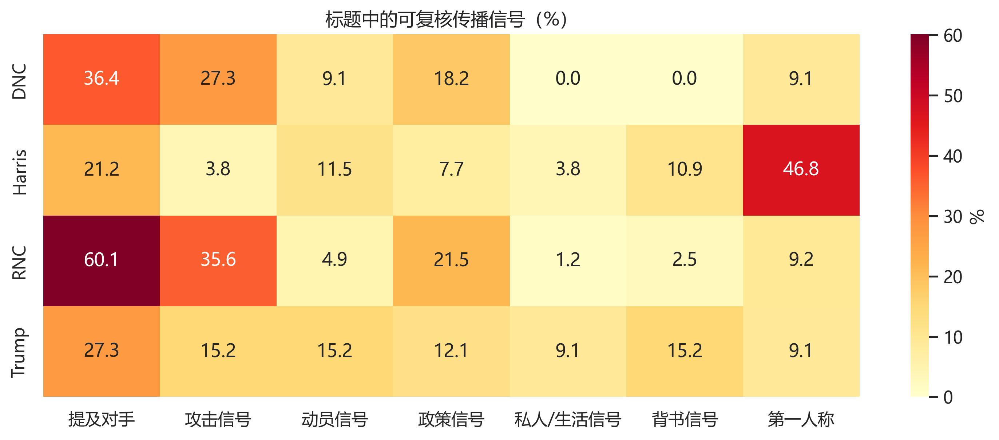
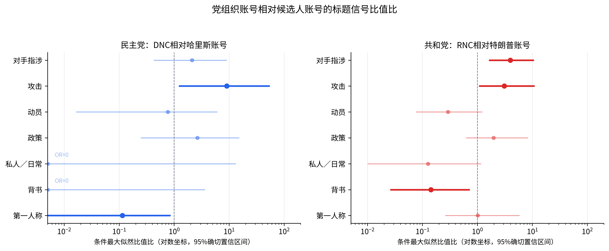

<!-- 投稿版旧稿（2026.08.28投稿、审稿人所审版本），由上传的docx经pandoc 3.9转换，正文未作任何改动；只加了标题层级标记并改了图片路径。行号供 v1_fix_checklist.md 引用。 -->

# 政党的平台化？美国两党的社交媒体使用研究
## ——基于2024年美国总统大选两党的比较

> 内容提要：候选人中心化常被理解为西方数字竞选中政党组织的退场，“商业公司党”一类政党类型学诊断更进一步，把政党视为围绕政治企业家运转的个人工具，社交媒体则被当作这一进程的加速器。基于“分布式竞选传播”的分析视角，本文以2024年美国总统大选为背景，将民主党、共和党两党的党组织账号与总统候选人账号视为同一阵营中的不同传播节点，对其官方短视频的发布强度、发布节奏、标题信号与累计平台注意力作系统的定量比较，并对主要结论作多重稳健性检验。研究发现，两党的生产配置截然相反，民主党以候选人账号为主要生产线，共和党则由党组织账号承担持续供给；分工方向存在跨党派一致性，党组织账号更集中承担对手指涉与负面定义，候选人账号则以人格化、关系性与背书表达占据前台，并汇聚阵营绝大部分累计注意力。这说明，既有文献所讨论的党组织的“退场”是一种错觉，社交媒体的工具逻辑并没有控制政党的组织逻辑；恰恰相反，组织逻辑仍然主导着社媒的传播配置，平台化竞选将其重构为后台化、专门化的传播活动节点。这为“政党衰退还是更新”的争论提供了经验证据。
>
> 关键词：商业公司党 美国两党 社交媒体 竞选

## 一、研究缘起

全球范围内的数字化浪潮直接或间接地改变了传统政治活动的展开方式，也进而改变了既有政治组织的活动方式与组织逻辑。政党自然也不例外，政党的数字化、平台化、智能化特征已广为关注。[^1]对此，大量关于社交媒体与选举竞选之间联系的研究认为，在数字化时代，大众时代的政党逻辑已经不再适用，因为候选人可以绕过新闻媒体和政党组织，直接面向选民说话，竞选因此更加个人化。[^2]在“商业公司党”（business-firm party）的理论看来，政党已经像企业一样围绕政治企业家组建，纲领服从营销，组织趋于轻量，政党整体上沦为政治家个人的竞选工具。[^3]数字平台则加速了这一进程：账号以个人姓名和头像为识别中心，注意力向候选人聚集，党组织的中介功能似乎可以被绕开。可是，“候选人更可见”并不能直接等同于“政党组织不再重要”。总统候选人的账号固然位于竞选传播前台，但对手监测、素材切割、负面框定、快速回应、议题重复和行动动员等活动并不会凭空完成。那么，在数字化的社交媒体时代，政党究竟如何应对数字化的冲击，西方政党的组织性又是否真正已经退居政治企业家（political entrepreneur）个人幕后？

2024年美国总统大选为观察这一问题提供了特殊窗口。2024年7月21日，约瑟夫·拜登（J. Biden）退出总统竞选，民主党在短时间内完成候选人更替；8月6日，民主党全国委员会（Democratic National Committee，以下简称DNC）宣布卡玛拉·哈里斯（K. Harris）和蒂姆·沃尔兹（Tim Walz）正式获得党内提名。[^4]共和党方面，唐纳德·特朗普（D. Trump）已经在7月举行的全国代表大会上获得提名。候选人转换、全国代表大会、电视辩论和选前冲刺相继发生，使阵营内部的传播资源必须被快速重新配置。

与此同时，短视频成为竞选内容的重要包装方式，政党与候选人已经把短视频当作政治传播的常规体裁。[^5]在诸多短视频平台中，本文以YouTube Shorts为观察窗口，而未选择TikTok、Instagram或Facebook，主要基于三点考虑。第一，从受众覆盖看，YouTube长期是美国成年人使用率最高的社交媒体平台，其短视频入口嵌在美国选民日常媒介使用的最大范围之内。[^6]第二，从账号齐备与数据可得看，两党党组织与两位候选人在YouTube均设有活跃官方频道，Shorts为四个账号提供了相同的技术格式，并公开展示观看、点赞与评论指标；TikTok在2024年选举周期则正处于封禁立法的争议之中，平台自身即是竞选议题的一部分，Instagram与Facebook的公开数据获取渠道则在2024年CrowdTangle停用后明显收窄。第三，从格式边界看，何为“短视频”由平台的Shorts页面统一划定，样本口径可以复核，无需研究者自行裁量。当然，平台为四个官方账号提供相似的技术格式，却不必然产生相同的组织使用方式，YouTube Shorts兼具视频平台的可检索性、订阅关系与算法推荐，一个账号可以被用作候选人的日常叙事窗口，也可以被用作党组织的反对派素材库；可以低频发布而依靠既有受众获得巨大观看，也可以高频生产以持续占据议题节奏。因此，研究单位不应只是“哪位候选人发了什么”，还应包括同一阵营内不同组织节点如何组合。

本文把民主党全国委员会、哈里斯、共和党全国委员会（Republican National Committee，以下简称RNC）和特朗普四个官方账号视为两个阵营中的四个组织位置，以2024年7月21日至11月5日发布的全部363条YouTube Shorts为样本，比较其发布强度、发布节奏、标题信号和累计平台注意力，在阵营内部考察“政党—候选人”的传播分工。为回应上述问题，本文将首先在政党类型学与平台化竞选研究两条线索中定位研究问题，说明“分布式竞选传播”的分析视角；进而交代研究设计与测量口径；随后报告数据分析结果；最后回到“商业公司党”命题，讨论社交媒体平台的工具逻辑与政党的组织逻辑之间的关系。

## 二、文献回顾与研究问题

### （一）政党组织的类型学变迁

政党类型学的百年谱系，几乎是一部政党组织地位的变迁史。迪维尔热（Maurice Duverger）笔下的“大众党”以支部为细胞、以庞大党员队伍为骨架，组织本身即是政党竞争力的来源。[^7]基希海默（Otto Kirchheimer）随后观察到，战后西欧政党淡化意识形态、跨阶级争取选票，转型为“全方位党”（catch-all party），组织与特定社会集团的纽带开始松动。[^8]帕内比昂科（Angelo Panebianco）进一步指出，竞选专业人士取代党员志愿者成为核心行动者，政党演化为“选举—职业党”。[^9]卡茨（Richard S. Katz）和梅尔（Peter Mair）的“卡特尔党”（Cartel party）命题则把政党与国家的相互渗透制度化，政党依托国家资源存续，其社会组织根基持续萎缩。[^10]沿着这条组织不断“变轻”的轨迹，霍普金（J. Hopkin）和保卢奇（C. Paolucci）提出的“商业公司党”则站在谱系的末端，政党如同企业围绕政治企业家组建，以市场营销的方式对待纲领和选民，党员功能微弱、科层结构简化，政党在相当程度上成为政治家个人的选举载具。对贝卢斯科尼（S. Berlusconi）式“个人党”的研究则把这一倾向推向极致——党为领袖所有，随领袖的政治生命而兴衰。[^11]

应该说，这一谱系是清晰的。组织不断让位于个人，而社交媒体的兴起似乎又为其提供了技术催化剂。在社交媒体上，账号以个人姓名和头像为识别中心，人格化表达天然适配平台可见性，候选人似乎第一次拥有了完全属于自己的传播基础设施。照此推演，数字竞选应当是“商业公司党”逻辑的完成形态，平台的工具逻辑接管政党的组织逻辑，党组织账号即使存在，也只是候选人个人品牌的附属性存在。

然而，政党研究的另一条线索并不接受这种单向叙事。鲍恩（Kathleen Bawn）等把美国政党重新界定为政策需求者集团的长期联盟，候选人是联盟筛选的产物；从这一视角看，个人可见性的扩张未必等于联盟组织能力的萎缩。[^12]查德威克（Andrew Chadwick）和斯特罗默—加利（Jennifer Stromer-Galley）把数字媒体与政党权力的关系概括为“衰退还是更新”的问题，指出旧组织并未被网络完全替代，而是在混合媒介系统中调整控制和参与方式。[^13]吉布森（Rachel Gibson）讨论“公民发起式竞选”时同样发现，数字媒介改变了组织边界，却没有使政党变得无关。[^14]多梅特（Katharine Dommett）等进一步提出“数字生态系统”（digital ecosystem），把政党放回由内部团队、外部咨询者、技术公司和平台共同构成的组织网络中。[^15]可见，前述两条线索的分歧最终可以归结为一个问题，即在候选人中心化的数字竞选中，党组织究竟是被吸收为个人工具，还是保有并重组了自身的组织功能？

### （二）平台化竞选与传播劳动的可配置性

新闻传播学对这一现象的观察提供了另一种理论解释。早期的网络竞选研究常把数字媒介的直接性与去中介化联系起来。候选人不必完全依赖记者和党组织，就能够发布完整讲话、回应争议并召集支持者。社交媒体进一步强化了这一趋势：账号以个人姓名和头像为识别中心，第一人称表达、私人生活与情绪展示容易获得可见度，政治信息也更经常被组织成“人物—追随者”的关系。恩利（Gunn Enli）对2016年美国总统竞选的研究指出，平台化的真实性表演有利于将候选人建构为不受既有政治规则束缚的“局外人”。[^16]拉斯曼（Uta Russmann）等对欧洲议会选举的比较也表明，政治人物的个人、私人和情绪表达已经成为社交媒体竞选的重要维度。[^17]但“去中介化”不等于不存在中介，候选人的表达仍依赖幕后团队选择素材、剪辑片段、适配平台并管理投放。克赖斯（D. Kreiss）等对美国竞选从业者的访谈显示，平台的技术架构和受众想象会进入策略制定过程，竞选团队并不是简单地把同质化的内容搬到不同平台，而是根据平台文化和功能作出选择。[^18]博塞塔（M. Bossetta）据此强调“数字架构”的差异，界面、网络结构、功能和算法共同塑造政治行动者的传播实践。[^19]平台表面上让候选人直接面对公众，背后却增加了素材生产、数据分析和跨平台协调等组织工作。可见，台前与幕后的关系，并不是简单的主从关系。

后续的平台研究进一步把这类组织安排上升为结构性概念。波尔（Thomas Poell）等以“平台化”（platformization）来指涉平台的基础设施、市场和治理逻辑向社会各领域延伸、文化实践围绕平台重组的过程。[^20]具体到竞选活动中，短视频的竖屏比例、快速开场、字幕、音乐、互动按钮和连续推荐，使政治表达被组织为易于识别、迅速判断并可被量化反馈的内容单元。克林格（Ulrike Klinger）和斯文松（Jakob Svensson）所谓“网络媒体逻辑”，正是指生产、分发和使用规则与大众媒体逻辑并存，并改变行动者争夺可见度的方式。[^21]在这种环境中，竞选传播至少包含四类可拆分任务：持续生产以维持存在感；建构候选人的人格与关系；界定对手和放大负面议题；把注意力转化为投票、捐款或参与等行动。

显然，为了执行这些任务，必然要付出不同的相对成本。候选人本人需要维持总统形象、联盟广度和正面愿景，持续使用尖锐攻击可能压缩其角色空间；党组织账号则较少承担个人亲和力维护，可以更加稳定地充当“攻击代理人”。传统负面竞选研究已经注意到政党、候选人和外部团体之间存在攻击分工，社交媒体又降低了快速切割和重复发布的成本。[^22]例如，标题是这种分工的基础，它决定用户在连续信息流中首先看到谁、如何评价谁以及是否值得继续观看。标题中反复出现对手姓名、失败、欺骗、激进或危机等词，不足以概括视频全部语义，却能显示账号把何种对象置于其可见传播的入口。

另一方面，候选人账号通常拥有更明确的个人品牌和更大的追随网络，更容易将背书者、竞选现场和日常片段吸收到“我／我们”的叙事中。第一人称表达既可以表示政策承诺，也可以制造直接关系；背书内容则把名人、党内精英和地方支持者接入候选人的个人传播中心。由此，党组织账号与候选人账号可能形成一种前台呈现自我、后台界定对手的互补结构，但这种结构不必然在两党之间完全对称。

### （三）研究问题

上述两条线索的交汇至一处，可以发现一种“分布式竞选传播”的分析视角。所谓分布式竞选传播，是指同一阵营把人格呈现、背书、动员、政策说明和负面传播等任务配置给不同账号节点，由此形成互补分工的传播组织方式。这一视角把阵营当作关系单位，不再把候选人账号与党组织账号看作同一功能的竞争者，转而考察组织逻辑如何在平台环境中配置传播资源。既有研究多以候选人或单一党派账号为单位，容易把组织分工压缩为账号风格差异；本文则在比较每个党派内部党组织与候选人的基础上，提出如下研究问题：

RQ1：两党阵营中，党组织账号与候选人账号在发布强度、时长和节奏上如何分工？

RQ2：党组织账号与候选人账号在对手指涉、攻击、第一人称、政策、动员、私人／日常和背书等标题信号上是否存在系统差异？

RQ3：上述分工是否因党派而异，即民主党与共和党是否形成不同的“党组织—候选人”配置？

RQ4：账号角色及标题信号与抓取时点的累计平台注意力、可见互动呈现何种关联？

这四个问题共同指向本文所关注的工具逻辑与组织逻辑之争。若商业公司党式的工具逻辑成立，可以预期党组织账号的产量与功能全面萎缩，内容与候选人账号高度同质，阵营传播结构随候选人个人品牌单向摆动；若组织逻辑仍占主导，则应观察到党组织账号承担候选人账号不便持续承担的专门化功能，阵营层面存在稳定的功能互补，且不同政党可以基于各自组织条件作出不同配置。

## 三、研究设计

### （一）账号、时间与样本口径

本文选择四个官方YouTube频道：DNC的“The Democrats”、民主党候选人“Kamala Harris”、RNC的“GOP”和共和党候选人“Donald J Trump”。四个账号分别对应两个阵营中的党组织和候选人位置。研究窗口为2024年7月21日至11月5日，含首尾两日共108日。起点是拜登宣布退出竞选之日，终点为总统选举日。该窗口覆盖民主党候选人转换、两党全国代表大会、总统辩论和选前冲刺。

样本以抓取时仍位于各频道Shorts页面、且发布日期处于研究窗口内的全部公开视频为准，按视频ID去重。最终获得363条：DNC 11条、哈里斯156条、RNC 163条、特朗普33条。全部样本时长不超过180秒，最长161秒。研究只采集公开视频可见的元数据，不下载附件，不采集用户身份及单条评论。

### （二）数据获取与变量

数据于2026年8月4日15时48分至15时53分获取。记录变量包括视频ID、标题、简介、发布日期、时长、观看数、点赞数、评论数、频道ID和公开链接。363条视频均取得核心元数据，1条RNC视频没有可见评论数。观看数、点赞数和评论数均为抓取时点的累计值。它们受到账号受众规模、视频上线时长、平台推荐、外部事件和后续传播的共同影响，不是2024年选举期间的即时反应。因此，本文把观看数称为“累计平台注意力”，把点赞率和评论率称为“可见互动强度”，并明确不把它们解释为态度改变或投票效果。点赞率为点赞数除以观看数，评论率为评论数除以观看数。

为避免把自动化结果伪装成人工语义判断，本文只对英文标题执行可复核的词典匹配，构造九个二元“标题信号”：（1）对手指涉、（2）攻击、（3）自方指涉、（4）动员、（5）政策、（6）私人／日常、（7）背书、（8）幽默和（9）第一人称。以共和党账号为例，标题出现Kamala、Harris、Biden、Walz、Democrats等词时记为对手指涉；出现lie、fraud、fail、radical、crisis、worst、refuse等词时记为攻击信号。民主党账号则以Trump、Vance、MAGA、Republicans等构造对手词典。动员词包括vote、register、make your plan、join和donate等；第一人称词包括I、we、my、our和us。相关核心词典见下表。除词典信号外，本文还为每条标题计算五项不依赖语义词典的“形式风格”指标：全大写（字母中大写占比不低于80%）、含感叹号、含问号、含引号以及标题词数。它们不涉及标题的语义内容，只测量标题在信息流入口处的形态呈现。

**表1 标题信号的判定规则与核心词典**

| 标题信号 | 判定规则 | 核心词例 |
|:---|:---|:---|
| 对手指涉 | 标题出现对方阵营候选人或政党指涉词 | 民主党账号：Trump, (JD) Vance, MAGA, Republicans, GOP, Project 2025；共和党账号：Kamala (Harris), (Tim) Walz, (Joe) Biden, Democrats, DNC |
| 攻击 | 对手指涉词与否定词同现（两者相乘） | 否定词如lie/lying, fraud, fail(ed), radical, dangerous, crisis, disaster, worst, corrupt, weak, refuse, unfit |
| 自方指涉 | 标题出现本方候选人或政党指涉词 | 民主党账号：Kamala Harris, (Tim) Walz, Democrats, President Biden；共和党账号：(Donald) Trump, (JD) Vance, Republicans, GOP, MAGA |
| 动员 | 出现投票、捐款或参与号召词 | vote/voting, register, make your plan, plan to vote, join us, donate, chip in |
| 政策 | 出现政策议题词 | economy, prices, tax(es), jobs, Medicare, Social Security, health care, abortion, border, immigration, crime, energy, democracy, Ukraine, Israel |
| 私人／日常 | 出现家庭、饮食等私人生活词 | family, mom(ala), dad, husband, Doug, baby, recipe, food, sweet treat |
| 背书 | 出现背书动词或背书者姓名 | endorse(ment), back(s), support, listen to；Barack/Michelle Obama, Jennifer Lopez, Bruce Springsteen, Anuel AA, Tulsi, RFK |
| 幽默 | 出现幽默、玩梗词 | lol, meme, joke, word salad |
| 第一人称 | 出现第一人称代词 | I, I'm, me, my, we, we're, our, us |

### （三）数据分析方法

首先，在描述四账号发布总量、时长与累计注意力分布的基础上，对“资源配置”作正式检验：以阵营为单位构造候选人账号产量份额的2×2列联表，报告Fisher确切检验、条件最大似然比值比及其95%确切置信区间。发布节奏以逐日发布计数刻画，报告活跃天数占比、单日峰值、最长间断，以及日计数的方差—均值比并作卡方散布检验，用以区分“匀速供给”与“爆发式集中”两种节奏。

其次，在民主党和共和党内部，分别比较党组织账号与候选人账号。二元标题信号使用Fisher确切检验，同时报告条件最大似然比值比、95%确切置信区间和Newcombe法风险差区间；观看数、点赞率和评论率使用Mann—Whitney U检验，效应量报告秩双列相关及分层自助法（5000次重抽样）置信区间，并以中位数之比及其自助法区间给出可直观解读的倍数。为降低多次比较带来的偶然显著，上述20项比较统一采用本杰明尼—霍赫贝格（Benjamini—Hochberg）方法校正*p*值。针对词典构造可能引入的任意性，本文对对手指涉与攻击信号执行逐词剔除的敏感性分析，并报告否定词不与对手指涉相乘的替代口径。

再次，两党分工是否不同（RQ3）不能靠并列呈现两组党内差异来回答，必须直接检验“党派×账号角色”交互。对每项标题信号，本文以阵营内置换（20000次）检验两党“党组织—候选人”比例差之差，辅以Haldane校正的比值比之比及其Wald区间；对累计注意力，则在回归框架中检验交互项系数。

最后，累计观看数呈重尾计数分布且过度离散明显，本文以NB2负二项回归为主要设定（最大似然估计离散参数，HC1稳健标准误，系数以发生率比呈现），同时报告对数观看数的普通最小二乘（HC3稳健标准误）与中位数回归、泊松准最大似然作为稳健性参照；点赞率以分数logit（Papke—Wooldridge）与经验logit普通最小二乘互证。模型同时纳入对手指涉、动员、政策、私人／日常、背书、时长和发布日期。

## 四、研究发现

### （一）两党的不同传播策略

如表2所示，两个阵营把短视频生产配置给了不同节点。民主党方面，哈里斯账号在108天内发布156条，日均1.44条；DNC仅发布11条，日均0.10条，候选人账号占该阵营样本的93.4%（95%CI：88.6%—96.3%）。共和党方面则相反：RNC发布163条，日均1.51条；特朗普账号发布33条，日均0.31条，党组织账号占该阵营样本的83.2%（95%CI：77.3%—87.7%）。把两阵营的“候选人—党组织”产量放进同一个2×2列联表，候选人份额之差对应的确切比值比达到68.6（95%CI：32.9—156.6，Fisher *p* \< 0.001）。可以说，民主党和共和党两个阵营所形成的是两套相反的传播结构。

**表2 四个官方账号的样本与累计平台指标**

| **账号** | **角色** | **样本量** | **日均发布** | **时长中位数（秒）** | **观看中位数** | **点赞率中位数** | **评论率中位数** |
|:--:|:--:|:--:|:--:|:--:|:--:|:--:|:--:|
| DNC | 党组织 | 11 | 0.10 | 29 | 11,344 | 3.34% | 0.98% |
| Harris | 候选人 | 156 | 1.44 | 30 | 224,932 | 5.32% | 0.44% |
| RNC | 党组织 | 163 | 1.51 | 25 | 1,068 | 7.77% | 0.86% |
| Trump | 候选人 | 33 | 0.31 | 16 | 234,260 | 8.93% | 0.66% |

注：观看、点赞和评论为2026年8月24日抓取时点累计值；点赞率和评论率分别以观看数为分母。

发布节奏进一步区分了两套结构内部的四种生产方式。RNC在108天中有80天发布内容，活跃天数占比74.1%，最长间断仅4天，多数周发布8至14条，10月21日所在周达到22条；其日发布计数的Fano因子为1.28，卡方散布检验不能拒绝匀速的泊松节奏（*p* = 0.053），在四个账号中最接近一台匀速运转的日常生产机器。哈里斯账号活跃42天（38.9%），Fano因子达4.16（*p* \< 0.001），发布高度成簇，尤其在10月期间进入高频冲刺阶段，10月14日、21日和28日三个自然周分别发布30、28和36条，单日峰值12条，11月4日所在的两天又发布23条。特朗普账号仅活跃22天（20.4%），最长间断30天，主要集中在9月中下旬；DNC只在10个自然日出现，最长间断同样达30天，仅在全国代表大会后零星发布。

四账号的中位时长差异不大：DNC 29秒、哈里斯30秒、RNC 25秒、特朗普16秒。因而，数量结构不能简单归因于某一账号只发布更短、更容易制作的片段。更合理的解释是，阵营两方对Shorts生产权作出了不同的组织安排，即民主党以候选人账号为主阵地，共和党则让党组织账号承担该功能。

**图1 样本期发布量与单条累计观看中位数**

注：右图使用对数坐标；累计观看截至2026年8月4日。

### （二）党组织承担什么功能？

标题信号揭示了党组织账号更具体的功能。表3报告四账号的信号比例，表4给出阵营内“党组织—候选人”对比的风险差、确切比值比与置信区间，图3以森林图呈现同一信息。DNC有36.4%的标题指涉对手，27.3%出现攻击词；哈里斯账号对应比例为21.2%和3.8%。尽管DNC只有11条，攻击信号的差异仍具有统计显著性：风险差23.4个百分点（95%CI：5.4—52.8），确切比值比9.10（95%CI：1.25—53.5），多重校正后p＝0.039。DNC发布的“5个特朗普最差辩论场面”（5 Worst Trump Debate Moments）、“特朗普是骗子”（Trump is a fraud）和“特朗普的竞选在隐瞒什么？”（What is the Trump campaign hiding），都把对手评价直接放进标题；相对而言，哈里斯账号即使批评特朗普，也更常使用完整陈述或候选人发言作为入口。

**表3 四个官方账号标题信号比例（%）**

| **标题信号** | **DNC** | **Harris** | **RNC** | **Trump** |
|--------------|---------|------------|---------|-----------|
| 对手指涉     | 36.4    | 21.2       | 60.1    | 27.3      |
| 攻击         | 27.3    | 3.8        | 35.6    | 15.2      |
| 动员         | 9.1     | 11.5       | 4.9     | 15.2      |
| 政策         | 18.2    | 7.7        | 21.5    | 12.1      |
| 私人／日常   | 0.0     | 3.8        | 1.2     | 9.1       |
| 背书         | 0.0     | 10.9       | 2.5     | 15.2      |
| 第一人称     | 9.1     | 46.8       | 9.2     | 9.1       |

注：同一标题可同时命中多个信号。

共和党的差异更稳定。RNC有60.1%的标题出现对手指涉，35.6%出现攻击词；特朗普账号分别为27.3%和15.2%。对手指涉的风险差为32.9个百分点（95%CI：14.3—47.0），确切比值比3.99（95%CI：1.66—10.4，校正p＝0.005）；攻击信号的确切比值比为3.08（95%CI：1.09—10.8，校正p＝0.049）。RNC账号持续将哈里斯定义为“失败”“激进”“不可信”或“拒绝回答”，例如“卡玛拉……严重失败”（Kamala……she's failed tremendously），“卡玛拉说美国梦已经死亡”（Kamala says the American Dream is dead）。这些对候选人的直接攻击，是RNC党组织账号长期、高频的对手监测与负面定义的舆论手段。

**图2 四账号标题中的可复核传播信号**

注：数值为各账号标题命中固定词典的比例；同一标题可同时命中多个信号。

上述差异对词典构造并不敏感，但稳健程度在两党之间有别。逐词剔除的敏感性分析显示，共和党的对手指涉差异在全部10个词典变体中保持显著（p≤0.002），攻击差异在51个变体中有45个显著，最大*p*值为0.060；民主党的攻击差异在49个变体中有45个显著，失效的4个变体均对应剔除对手姓名词Trump或某个关键否定词。可见，党组织账号的负面性集中体现为点名对手与否定评价两种策略的组合。

**表4 阵营内“党组织—候选人”标题信号对比**

| **标题信号** | **阵营** | **党组织（%）** | **候选人（%）** | **风险差（百分点）** | **确切OR** | **95%CI（OR）** | **校正*p*** |
|:--:|:--:|:--:|:--:|:--:|:--:|:--:|:--:|
| 对手指涉 | 民主党 | 36.4 | 21.2 | 15.2 | 2.12 | \[0.43, 8.94\] | 0.376 |
| 攻击 | 民主党 | 27.3 | 3.8 | 23.4 | 9.10 | \[1.25, 53.5\] | 0.039 |
| 动员 | 民主党 | 9.1 | 11.5 | -2.4 | 0.77 | \[0.02, 6.00\] | 1.000 |
| 政策 | 民主党 | 18.2 | 7.7 | 10.5 | 2.64 | \[0.25, 15.1\] | 0.357 |
| 私人／日常 | 民主党 | 0.0 | 3.8 | -3.8 | 0 | \[0, 13.1\] | 1.000 |
| 背书 | 民主党 | 0.0 | 10.9 | -10.9 | 0 | \[0, 3.61\] | 0.757 |
| 第一人称 | 民主党 | 9.1 | 46.8 | -37.7 | 0.11 | \[0.003, 0.84\] | 0.049 |
| 对手指涉 | 共和党 | 60.1 | 27.3 | 32.8 | 3.99 | \[1.66, 10.4\] | 0.005 |
| 攻击 | 共和党 | 35.6 | 15.2 | 20.4 | 3.08 | \[1.09, 10.8\] | 0.049 |
| 动员 | 共和党 | 4.9 | 15.2 | -10.2 | 0.29 | \[0.08, 1.22\] | 0.078 |
| 政策 | 共和党 | 21.5 | 12.1 | 9.4 | 1.98 | \[0.63, 8.25\] | 0.450 |
| 私人／日常 | 共和党 | 1.2 | 9.1 | -7.9 | 0.13 | \[0.01, 1.15\] | 0.063 |
| 背书 | 共和党 | 2.5 | 15.2 | -12.7 | 0.14 | \[0.03, 0.71\] | 0.026 |
| 第一人称 | 共和党 | 9.2 | 9.1 | 0.1 | 1.01 | \[0.26, 5.80\] | 1.000 |

注：OR为党组织账号相对候选人账号的条件最大似然比值比，区间为95%确切置信区间；OR＝0表示党组织账号无命中。校正*p*为Benjamini—Hochberg方法在20项比较族（含观看数、点赞率与评论率检验）内的校正值。风险差＝党组织比例−候选人比例。

**图3 党组织账号相对候选人账号的标题信号比值比**

注：横轴为对数坐标，区间为95%确切置信区间；深色加粗线表示Benjamini—Hochberg校正后p＜0.05；OR＝0（党组织账号无命中）绘于坐标下限。数值见表4。

值得注意的是，把两党“党组织—候选人”比例差之差作正式交互检验后，没有任何一项标题信号的党际差异在多重校正后达到显著（阵营内置换检验，最小校正p＝0.145）。换言之，就标题信号的分工方向而言，两党是一致的：党组织更负面，候选人更人格化；真正相反的是产量配置与注意力结构。基于此，可以把两党党组织账号理解为不同强度的“负面传播承包者”。在民主党阵营，DNC产量很低，却在有限内容中选择性放大特朗普的辩论表现、诚信问题和竞选信息；在共和党阵营，RNC既高频生产，又把对手姓名与否定词组合为日常内容。可见，二者的共同点在于，在社交媒体的传播策略上，候选人中心化并没有消灭党组织的作用，相反，党组织承担了候选人不必持续亲自完成的负面指涉等“不光彩”活动。

### （三）候选人承担什么功能？

民主党阵营候选人账号最显著的特征是第一人称的使用。哈里斯账号46.8%的标题包含I、we、my、our或us，DNC账号仅为9.1%（95%CI：0.003—0.84，校正p＝0.049）。高注意力标题包括“拜登总统和我”（President Biden and I）、“谢谢佐治亚”（Thank you, Georgia）、“是时候投票了”（It's time to make your plan to vote）等。这些标题将竞选活动组织为候选人与特定个人、州及支持者之间的关系网络，第一人称既标示了候选人的主体位置，也构成一种将选民纳入“我们”范畴的语言策略。

此外，哈里斯账号还借助竞选现场、地方致意、日常饮食与名人背书等素材拓展这一关系叙事。例如，“与‘老板’和奥巴马总统一同踏上竞选之路”（On the trail with the Boss \[and President Obama\]）将布鲁斯·斯普林斯汀与奥巴马纳入竞选行程；“听听詹妮弗·洛佩兹：你的选票就是你的声音，让我们放声呐喊”（Listen to @JenniferLopez: Your vote is your voice. Let's get loud.）将名人背书与投票动员相叠加；“没有什么比得上竞选路上的这些时刻”（Nothing compares to moments like these on the campaign trail）则将现场片段建构为可供分享的情感体验。高频的第一人称使用与上述代表性标题相互印证，表明民主党候选人账号不仅承担信息发布功能，亦发挥维系阵营关系与情感动员的作用。

特朗普账号的传播功能则更集中于身份口号、政治动员与精英／名人背书三个面向。“让美国再次伟大！”（MAKE AMERICA GREAT AGAIN!）、“未来命悬一线”（THE FUTURE IS AT STAKE）、“拯救我们的经济——投票给特朗普！”（SAVE OUR ECONOMY—VOTE TRUMP!）等标题将候选人身份、危机框架与行动号召压缩于极短文本之中；“谢谢你，Anuel AA！”（THANK YOU Anuel AA!）以及涉及塔尔西·加巴德、罗伯特·肯尼迪的内容，则将背书者直接纳入候选人的个人品牌体系。统计结果显示，特朗普账号15.2%的标题包含背书信号，RNC账号仅为2.5%；其动员信号亦高于RNC账号。

标题的形式风格提供了词典之外的第二重证据。特朗普账号39.4%的标题为全大写，RNC仅9.2%（确切比值比6.33，95%CI：2.40—16.8，校正p＝0.001）；其标题中位词数只有6个，短于RNC的8个（校正p＝0.044）。民主党方向相反，哈里斯账号标题中位词数达11个，DNC仅5个（校正p＝0.007）。民主党候选人账号倾向完整陈述句，共和党候选人账号则以短促口号为主。RNC则有45.4%的标题带感叹号、11.7%带引号，且通常为转引哈里斯原话作攻击素材，前者高于特朗普账号的27.3%。总之，党组织账号一侧最具区分度的词是Kamala、Harris、border、liberal、can't一类对手命名与否定评价词，候选人账号一侧则是thank、you、your、my、our一类致谢、第二人称与关系词。可以说，两位候选人的“个性化”策略也各有差异。哈里斯账号以高频更新、第一人称、地方关系和竞选途中片段构成民主党候选人叙事；特朗普账号发布较少，却以简短口号、个人品牌、背书和号召形成高集中度表达。这就是说，政治传播个性化需要被拆分为至少两种组织形式：关系性、连续性的候选人叙事，以及品牌化、事件化的候选人广播。

### （四）受众：播放量与评论率

四账号的累计播放量呈现出极强的层级分化。哈里斯账号总播放量8198.5万，中位数22.49万；DNC总播放量17.58万，中位数1.13万。特朗普账号总播放量1448.6万，中位数23.43万；RNC总播放量62.14万，中位数仅1068。党内比较均显示候选人账号的单条中位播放量显著更高：民主党的中位数之比为19.8倍（95%CI：12.7—47.2，校正p＜0.001）；共和党达219.3倍（95%CI：145.8—287.2，校正p＜0.001）。

**表4 累计播放量的负二项回归与对数播放量OLS**

| **变量** | **NB发生率比** | **NB的95%CI** | **NB p** | **OLS系数** | **OLS的95%CI** | **OLS *p*** |
|:--:|:--:|:--:|:--:|:--:|:--:|:--:|
| 截距 | 887,844 | \[488,708, 1,612,961\] | ＜0.001 | 12.755 | \[12.247, 13.263\] | ＜0.001 |
| 共和党 | 0.65 | \[0.42, 0.99\] | 0.047 | -0.135 | \[-0.494, 0.224\] | 0.461 |
| 党组织账号 | 0.036 | \[0.018, 0.072\] | ＜0.001 | -3.104 | \[-3.709, -2.499\] | ＜0.001 |
| 共和党×党组织账号 | 0.33 | \[0.15, 0.74\] | 0.007 | -1.732 | \[-2.429, -1.034\] | ＜0.001 |
| 对手指涉 | 0.87 | \[0.59, 1.28\] | 0.466 | -0.165 | \[-0.420, 0.091\] | 0.206 |
| 动员 | 0.80 | \[0.51, 1.26\] | 0.332 | 0.023 | \[-0.346, 0.392\] | 0.903 |
| 政策 | 0.69 | \[0.47, 1.02\] | 0.060 | -0.114 | \[-0.439, 0.210\] | 0.491 |
| 私人／日常 | 1.55 | \[0.89, 2.69\] | 0.122 | 0.644 | \[0.011, 1.276\] | 0.046 |
| 背书 | 2.11 | \[1.24, 3.61\] | 0.006 | 0.708 | \[0.211, 1.205\] | 0.005 |
| 时长（秒） | 0.99 | \[0.98, 1.00\] | 0.010 | -0.006 | \[-0.012, 0.000\] | 0.055 |
| 发布日序 | 1.00 | \[0.99, 1.00\] | 0.492 | -0.002 | \[-0.006, 0.003\] | 0.516 |

注：*N*＝363。NB为NB2负二项回归（HC1稳健标准误），离散参数α＝1.13（95%CI：0.97—1.30）；OLS因变量为log(1＋播放量)（HC3稳健标准误），R²＝0.844。“党派×角色”组合饱和四个账号，等价于账号固定效应；因同日抓取，控制发布日序即控制曝光时长。截距为基线组（民主党候选人账号、各信号为0、时长与日序为0）的条件期望。

内容变量中，只有背书信号的正关联在各设定中稳健，负二项发生率比2.11（95%CI：1.24—3.61，p＝0.006），普通最小二乘与中位数回归同向显著。私人／日常信号仅在普通最小二乘中勉强越过0.05（p＝0.046），在负二项与中位数回归中均不显著；对手指涉、动员和政策信号在各设定中都没有稳定关联，时长则与播放量呈弱负相关（发生率比0.988/秒，p＝0.010）。此外，注意力在账号内部的分布同样支持“品牌广播”与“持续叙事”的区分。特朗普账号观看最高的3条视频占其总播放量的51.3%，哈里斯账号仅为18.2%；账号内播放量的基尼系数介于0.47与0.66之间。以阵营合计，候选人账号吸纳民主党累计播放量的99.8%（95%CI：99.6%—99.9%）、共和党的95.9%（95%CI：92.2%—97.7%）。资源与注意力在共和党内部明显错位，RNC生产了阵营83.2%的视频数，却只获得阵营4.1%的播放量。

值得注意的是，党组织账号在评论率上并未同播放量一样全面退居劣势。DNC的中位评论率为0.98%，高于哈里斯的0.44%（95%CI：0.25—0.82，校正p＝0.005）；RNC为0.86%，也高于特朗普的0.66%（95%CI：0.67—0.91，校正p＝0.039）。点赞率的党内差异则呈现党派不对称，哈里斯账号高于DNC（95%CI：1.15—2.30，校正p＝0.011），特朗普账号与RNC没有显著差异。

### （五）候选人与政党组织的分工

综合发布产量、发布节奏、标题特征与累计观看量四个维度，可将四个账号归纳为四种差异化的角色类型。第一，DNC账号属于低发布强度的事件驱动型，它在108天的观察期内仅于10个自然日发布内容，有限的产量集中投向党代会、投票及对手争议等关键政治事件，呈现出以重大节点为导向的选择性投放策略。第二，哈里斯账号属于高发布强度的关系建构型，它承担了民主党阵营93.4%的Shorts产量，发布行为在时间轴上呈簇状聚集；标题层面近半数采用第一人称，中位长度为11个词，体现出以维系候选人—支持者关系为目标的持续叙事投入。第三，RNC账号属于高发布强度的对手指向型，它的活跃天数占比74.1%，发布节奏在统计上接近均匀分布；六成标题指涉政治对手，且总产量居各账号之首，表明其功能定位在于对对手的持续命名、评价与负面界定。第四，特朗普账号属于低发布强度的高注意力集中型，它的近四成标题采用全大写形式；注意力分布高度集中，排名前3位的视频即贡献了总观看量的一半，单条视频观看中位数达到RNC账号的219倍，符合以个人品牌为核心的传播模式。

可见，民主党形成了一种候选人主生产、党组织选择性支援的传播架构，而共和党则形成了一种党组织主生产、候选人高注意力广播的架构。两套架构都保留了党组织，却赋予党组织不同的产量权重。由此，党组织的数字地位不能只用粉丝数、单条观看或是否人格化判断。一个账号即使没有占据注意力中心，也可能通过高频供给、对手监测和议题重复成为阵营传播不可缺少的幕后力量。

## 五、结论与讨论

### （一）主要发现

本文以2024年美国总统大选为研究背景，考察108天观察窗口内民主党、共和党两党组织及候选人四个官方YouTube账号发布的363条Shorts。研究发现，候选人中心化并不意味着党组织退出数字竞选。就本次大选而言，两党均形成了分布式传播结构，但其分布形态呈显著不对称：候选人账号占阵营产量的份额在民主党高达93.4%，在共和党仅为16.8%（确切比值比68.6，*p*＜0.001）。民主党以哈里斯账号为高频生产中心，DNC账号进行低发布强度、事件驱动的选择性投放；共和党以RNC账号维持高发布强度、节奏近乎匀速的对手指向传播，特朗普账号则呈现低发布强度、高注意力集中的个人品牌传播特征。尽管形态不对称，两党在功能分工的方向上却是一致的：党组织账号均更集中地承担对手指涉与负面定义，候选人账号则汇聚了阵营95.9%以上的累计观看量，并以第一人称关系叙事或背书表达占据竞选前台。

本文的贡献在于，将政治传播个性化的研究视角从单一账号的风格层面，推进至阵营内部的组织分工层面。在平台化竞选中，政党与候选人难以构成零和替代关系；更为准确的描述是，传播劳动在多个账号之间发生了重新配置。据此，评估政党是否“衰退”，不能仅以政党账号是否拥有最多粉丝或最高观看量为依据，还需考察其是否承担了持续生产、对手定义、议题监测与传播放大等后台功能。

### （二）理论对话

按照商业公司党模型的工具逻辑推演，本文的观察对象本应呈现另一番景象：党组织账号萎缩为候选人内容的中继转发端，乃至彻底沉寂；阵营传播结构随候选人个人品牌的强弱单向摆动；党组织即便保持发布，其标题入口也应与候选人账号高度同质。[^23]然而，四个账号的经验证据与上述预期存在系统性偏离。

其一，两党的党组织账号均保有候选人账号所不具备的专门化功能。持续的对手监测、负面定义与议题重复属于典型的组织性劳动，其特征在于持续供给、标准化生产与声誉成本的组织化分摊，而非依附于候选人的个人魅力；RNC近乎匀速的发布节奏更接近科层制的例行化生产，与政治企业家的即兴式传播相去甚远。其二，共和党的配置尤具悖论意味。在通常被认为特朗普个人化程度最高的阵营中，承担八成以上日常生产的恰恰是党组织账号，候选人账号的注意力优势以党组织持续的后台劳动为支撑。其三，民主党在候选人临时更替的极端情形下将生产权集中于候选人账号，同样是阵营层面的组织决策。新候选人需要在较短时间内建立全国性叙事，高频的第一人称使用与竞选行程内容有助于快速充实候选人形象，DNC则保留选择性放大功能；而共和党的“党组织主生产”结构使RNC能够围绕民主党的候选人更替、执政表现与政策争议持续开展监测，特朗普账号则保留为高注意力、强品牌的传播端。

质言之，两党采用了不同的社交媒体使用逻辑，但这种差异属于阵营内部的分工配置。并非社交媒体的工具逻辑支配了政党的组织逻辑；恰恰相反，政党的组织逻辑仍居主导地位，平台可供性如何被动用，取决于组织对分工的安排。换言之，平台环境似乎规定了分工的方向，党组织更适合承担负面内容的宣发，候选人更适合承担关系建构的前台；而政党的组织选择决定了分工的具体配置。Shorts为所有账号提供了相近的时长限制、界面形态与反馈指标，政党仍会依据候选人品牌、团队资源、既有账号基础与竞选策略作出不同配置。平台化应被理解为技术可供性与组织选择的结合；单向度的平台决定论难以解释两党之间的分化。

总之，“政党沦为政治家个人工具”的诊断未获得政治传播层面证据的支持。候选人的确占据可见性前台，但前台之下是党组织持续运转的专门化传播体系。

### （三）局限与展望

当然，本文尚存在若干明确的局限。第一，本文仅考察YouTube Shorts单一平台，结论不能直接外推至全部平台；不同平台之间还可能存在素材复用与任务再分配。第二，标题词典提供的是可复核的词汇信号，而非完整的视频语义或多模态编码；逐词剔除的敏感性分析虽显示主要差异对词典构造不敏感，但词典本身仍由研究者设定，难以完全排除建构过程中的主观判断。第三，DNC的样本量仅为11条。功效模拟显示，在候选人账号3.8%的基线比例下，该样本量对比值比小于13的差异不具备80%的统计检验力；DNC攻击信号的差异虽已通过确切检验并在多数词典变体中保持显著，其证据强度仍应视为探索性的。第四，互动指标抓取于2026年，属于长期累计值，无法还原选举期间的即时扩散过程。第五，公开数据不能直接揭示竞选团队内部形成上述分工的具体动因。概言之，效应量区间、置换检验、词典变体与多种回归设定的一致，只能增强本文描述性发现的稳健性，而不能逾越上述推论边界。

后续研究可从三个方向推进：其一，跨平台追踪同一素材的流转，识别不同账号与平台之间的传播链；其二，对视频画面、声音、字幕与剪辑开展人工多模态编码，并报告编码者间一致性；其三，结合竞选从业者访谈与发布后分时点指标，验证“负面外置”究竟是明确的组织策略，还是平台分发机制与账号历史共同塑造的结果。对政党类型学而言，本文的启示在于，“公司化”与“个人化”的判断应当区分可见性的表层与组织功能的深层，官方账号结构为此提供了一个可持续观察的经验界面。无论如何，2024年四个账号的结构已经表明：西方数字竞选中最醒目的往往是候选人，而最持续的却未必只有候选人。

本文系

作者：

[^1]: 王翔、李志恒：《西方政党的数字化变革：技术驱动下的组织重塑与动员逻辑》，《中国人民大学学报》2026年第3期。

[^2]: 王翔、李志恒：《全球数字化转型与西方政党政治运行逻辑的变革》，《开放时代》2026年第3期；陈家喜：《政党数字化：数字时代西方政党政治的实践图景与理论审视》，《当代世界与社会主义》2025年第6期；丁辉：《数字化政党：一个非类型学的理论框架》，《政治学研究》2024年第1期。

[^3]: Hopkin, J., & Paolucci C., “The Business Firm Model of Party Organisation: Cases from Spain and Italy,” *European Journal of Political Research*, vol. 35, no. 3, 1999, pp. 307–339.

[^4]: 美国民主党全国委员会在2024年7月21日发表关于拜登退出竞选的声明，并于8月6日宣布哈里斯、沃尔兹完成党内提名认证。参见Democratic National Committee, “Statement from DNC Chair Jaime Harrison,” July 21, 2024, https://democrats.org/statement-from-dnc-chair-jaime-harrison/；Democratic National Committee, “Democratic Party Announces Kamala Harris and Tim Walz Officially Certified as Democratic Nominees for President and Vice President,” August 6, 2024, https://democrats.org/democratic-party-announces-kamala-harris-and-tim-walz-officially-certified-as-democratic-nominees-for-president-and-vice-president/，访问日期：2026年8月24日。

[^5]: Juan Carlos Medina Serrano, Orestis Papakyriakopoulos and Simon Hegelich, "Dancing to the Partisan Beat: A First Analysis of Political Communication on TikTok," in *Proceedings of the 12th ACM Conference on Web Science*, New York: ACM, 2020, pp. 257–266, doi:10.1145/3394231.3397916；Laura Cervi and Carles Marín-Lladó, "What Are Political Parties Doing on TikTok? The Spanish Case," *Profesional de la información*, vol. 30, no. 4, 2021, e300403, doi:10.3145/epi.2021.jul.03.

[^6]: 参见Pew Research Center, “Americans' Social Media Use 2025,” November 20, 2025, https://www.pewresearch.org/internet/2025/11/20/americans-social-media-use-2025/ ，访问日期：2026年8月25日。

[^7]: Maurice Duverger, *Political Parties: Their Organization and Activity in the Modern State*, trans. Barbara North and Robert North, London: Methuen & Co., 1954.

[^8]: Otto Kirchheimer, “The Transformation of the Western European Party Systems,” in Joseph LaPalombara and Myron Weiner, eds., *Political Parties and Political Development*, Princeton: Princeton University Press, 1966, pp. 177–200.

[^9]: Angelo Panebianco, *Political Parties: Organization and Power, trans. Marc Silver*, Cambridge: Cambridge University Press, 1988.

[^10]: Richard S. Katz and Peter Mair, “Changing Models of Party Organization and Party Democracy: The Emergence of the Cartel Party,” *Party Politics*, vol. 1, no. 1, 1995, pp. 5–28.

[^11]: Duncan McDonnell, “Silvio Berlusconi’s Personal Parties: From Forza Italia to the Popolo della Libertà,” *Political Studies*, vol. 61, no. S1, 2013, pp. 217–233；Glenn Kefford and Duncan McDonnell, “Inside the Personal Party: Leader-owners, Light Organizations and Limited Lifespans,” *The British Journal of Politics and International Relations*, vol. 20, no. 2, 2018, pp. 379–394.

[^12]: Kathleen Bawn, Martin Cohen, David Karol, Seth Masket, Hans Noel and John Zaller, “A Theory of Political Parties: Groups, Policy Demands and Nominations in American Politics,” *Perspectives on Politics*, vol. 10, no. 3, 2012, pp. 571–597.

[^13]: Andrew Chadwick and Jennifer Stromer-Galley, “Digital Media, Power, and Democracy in Parties and Election Campaigns: Party Decline or Party Renewal?” *The International Journal of Press/Politics*, vol. 21, no. 3, 2016, pp. 283–293.

[^14]: Rachel K. Gibson, “Party Change, Social Media and the Rise of ‘Citizen-Initiated’ Campaigning,” *Party Politics*, vol. 21, no. 2, 2015, pp. 183–197.

[^15]: Katharine Dommett, Glenn Kefford and Sam Power, “The Digital Ecosystem: The New Politics of Party Organization in Parliamentary Democracies,” *Party Politics*, vol. 27, no. 5, 2021, pp. 847–857.

[^16]: Gunn Enli, “Twitter as Arena for the Authentic Outsider: Exploring the Social Media Campaigns of Trump and Clinton in the 2016 US Presidential Election,” *European Journal of Communication*, vol. 32, no. 1, 2017, pp. 50–61.

[^17]: Uta Russmann, Ulrike Klinger and Karolina Koc-Michalska, “Personal, Private, Emotional? How Political Parties Use Personalization on Facebook in the 2019 European Parliament Election Campaign,” *Social Science Computer Review*, vol. 42, no. 5, 2024, pp. 1204–1222.

[^18]: Daniel Kreiss, Regina G. Lawrence and Shannon C. McGregor, “In Their Own Words: Political Practitioner Accounts of Candidates, Audiences, Affordances, Genres, and Timing in Strategic Social Media Use,” *Political Communication*, vol. 35, no. 1, 2018, pp. 8–31.

[^19]: Michael Bossetta, “The Digital Architectures of Social Media: Comparing Political Campaigning on Facebook, Twitter, Instagram, and Snapchat in the 2016 U.S. Election,” *Journalism & Mass Communication Quarterly*, vol. 95, no. 2, 2018, pp. 471–496.

[^20]: Thomas Poell, David Nieborg and José van Dijck, “Platformisation,” *Internet Policy Review*, vol. 8, no. 4, 2019.

[^21]: Ulrike Klinger and Jakob Svensson, “The Emergence of Network Media Logic in Political Communication: A Theoretical Approach,” *New Media & Society*, vol. 17, no. 8, 2015, pp. 1241–1257.

[^22]: Conor M. Dowling and Amber Wichowsky, “Attacks without Consequence? Candidates, Parties, Groups, and the Changing Face of Negative Advertising,” *American Journal of Political Science*, vol. 59, no. 1, 2015, pp. 19–36；Erika Franklin Fowler, Michael M. Franz and Travis N. Ridout, *Political Advertising in the United States*, Boulder: Westview Press, 2016.

[^23]: Mazzoleni O., & Voerman G., “Memberless Parties: Beyond the Business-Firm Party Model,” *Party Politics*, vol. 23, no. 6, 2017, pp. 783-792.
